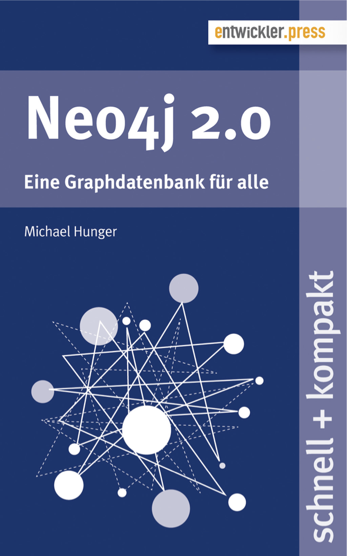

= Neo4j 2.0 (Graphs)-[:FOR]->(everyone)
:presenter: Michael Hunger
:twitter: mesirii
:email: michael@neotechnology.com
:backend: deckjs
:deckjsdir: ../../../asciidoc/deck.js
:deckjs_theme: neotech
:icons: font
:source-highlighter: codemirror
:navigation:
:goto:
:menu:
:status:
:arrows:
:customjs: ../../../asciidoc/js/checkcypher.js
:gist-source: https://raw.github.com/neo4j-contrib/gists/master/
:footer: © All Rights Reserved 2013 | Neo Technology, Inc.
:img: img
:logo: {img}/Neo_Technology.jpg
:allow-uri-read:
:video:
:docs-link: https://github.com/neo4j-contrib/asciidoc-slides[documentation]
:download-link: https://github.com/neo4j-contrib/asciidoc-slides/archive/master.zip[download]
:sectids!:
:deckjs_transition: none

++++

++++

== Who the hell is this guy?

* Michael Hunger
* Developer Evangelist Neo Technology
* Addicted to Graphs and helping People
* @mesirii | michael@neotechnology.com

== What will he talk about?

[options="step"]
* Quick history of Neo4j 
* Big changes in 2.0
* ... and what they mean for you
* The road ahead

== Question for you!

[options="step"]
* Have you used NoSQL DB's? Yes!
* Have you used Graph Databases?
* Have you used Neo4j?
* Have you used Neo4j before 2.0?

== A quick history of Neo4j

[options="step"]
* A small company in Sweden
* Bang
* 0.x ... small embeddable persistent graph library
* 1.x ... adding indexes, server, first stab of Cypher
* 2.x ... ease of use, data-model, optional schema, Browser

== The old days

[options="step"]
* A "small" graph-library
* Add neo4j-kernel (+ indexes) to dependencies
* Use the Java APIs
* Write tedious Java "POJOs" 
* Write your own wrappers

== Java API

[source,java,role=big]
----
GraphDatabaseService db = new EmbeddedGraphDatabase(PATH);
Node emil = db.createNode();
emil.setProperty("name","Emil");
Node johan = db.createNode();
johan.setProperty("name","Johan");

Relationship rel = 
  email.createRelationshipTo(johan, DynamicRelationshipType.withName("CO_FOUNDER"));
rel.setProperty("state","mental");
db.shutdown();
----

=== That's not enough

== Java API (Transactional)

[source,java,role=big]
----

   GraphDatabaseService db = new EmbeddedGraphDatabase(PATH);
   Transaction tx = db.beginTx();
   try {
     Node emil = db.createNode();
     emil.setProperty("name","Emil");
     Node johan = db.createNode();
     johan.setProperty("name","Johan");

     Relationship rel = 
       email.createRelationshipTo(johan, DynamicRelationshipType.withName("CO_FOUNDER"));
     rel.setProperty("state","mental");
     tx.success(); 
   } finally {
     tx.finish(); 
   }
   db.shutdown();
----

== Upping the Game - Neo4j 1.x

[options=step]
* Indexing
* Neo4j Server
* Cypher

== Indexing (now Legacy)

[source,java,role=big]
----
  Index<Node> people = db.index().forNodes("People");
  people.add(node, "name","Emil");
  IndexHits<Node> result = people.get("name","Emil");

  // Lucene leaks through
  IndexHits<Node> result = people.get("name:E*");
----

== Neo4j Server

[options=step]
* embed database in jetty
* add startup scripts
* expose REST API for Nodes, Relationships, Traversals and Graph-Algos
* Plugin- and Extension Mechanisms

== Add a Web-UI

[options=step]
  * Visualization
  * Console / Shell
  * Monitoring / Stats

[canvas-image="{img}/server_visualization.jpg"]
== Neo4j Server UI

== Neo4j Server Strengths

[options=step]
* easier to use
* nice Web-UI (for that time)
* good for exploration and demonstration
* packaged experience

== Great for people

[options=step]
* that want to install / deploy a server
* that don't use Java / JVM
* curl+json is good enough
* proliferation of non-JVM drivers (Ruby, Python, .Net, PHP, Perl)

//[canvas-image="{img}/neo4j_rest_drivers.jpg"]
== Some Neo4j Rest Drivers

image::{img}/neo4j_rest_drivers.jpg[height="700"]

== Neo4j Server Weaknesses

[options=step]
* database primitives too fine-grained over the wire
* explorative REST too verbose
* no streaming (in the beginning - memory hog)
* GraphDatabaseService API over the REST API is a leaky abstraction
* chatty and slow (latency)
* mirroring an embedded API was never a good idea

== Cypher for the Rescue

[options=step]
* (people)-[:HATE|LOVE]->(SQL)
* (people)-[:KNOW|USE]->(SQL)
* steal good ideas from other query languages

== Good ideas

[options=step]
* Graph Patterns are easy for the brain
* Readability is king
* Declarative is good - power to the database
* Idempotent - expecting structures
* Easy to integrate - like SQL
* Execute complex tasks as a single operation **inside** the database

== Cypher: Refresher

=== CREATE

[source,cypher]
----
CREATE (y:Year {year: 2014})
FOREACH (m in range(1,12) |
   MERGE (y)-[:HAS_MONTH]->(:Month {month:m})
)
----

=== MATCH

[source,cypher]
----
MATCH (y:Year {year: 2014})-[:HAS_MONTH]->(m)-[:HAS_DAY]->(d),
      (y)-[:HAS_WEEK]->(w)-[:HAS_DAY]->(d)
WHERE m.month = 2
RETURN w.week,collect(d)
ORDER BY w.week ASC
LIMIT 2
----

== Demo

++++
<iframe src="http://console.neo4j.org/r/cctayc" width="1500" height="600"></iframe>
++++

== Cypher APIs

=== Embedded

[source,java]
----
// re-use this reference
ExecutionEngine cypher = new ExecutionEngine(gdb);

String QUERY = "MATCH (u:User)-[FRIEND*2]-(friend2) WHERE u.name = {name} RETURN DISTINCT friend2.name";
ExecutionResult result = cypher.execute(QUERY, map("name","Andrés"))

for (Map<String,Object> row : result) {
   String friend2 = row.get("friend2.name")
}
----

=== Server API (2.0)

[source]
----
:POST /db/data/transaction[/commit] { statements: [
 {statement: "MATCH (u:User)-[FRIEND*2]-(friend2) WHERE u.name = {name} RETURN DISTINCT friend2.name",
  parameters: {name:"Andrés"}}
 , ... 
]}
----

== Cypher Drivers (JVM)

[options=step]
* Java - JDBC Driver (Java-Rest-Binding)
* Scala - AnormCypher
* Clojure - neocons
* (J)Ruby - neo4j.rb

=== Bigger List

* http://neo4j.org/drivers

== Cypher Drivers (Non-JVM)

[options=step]
* Ruby - neography
* Python - py2neo, neo4j-rest-client
* Ruby - neo4j.rb, neography
* .Net - Neo4jClient
* PHP - Neo4jPHP
* Perl - REST::Neo4p
* ... many more ...

== Big Leap Neo4j 2.0

[options=step]
* **first** change to data model - Node-Labels
* (optional) schema
* revamped Neo4j-Browser
* new transactional HTTP-endpoint

== Node-Labels

=== How do you add types to a graph?

=== Answer 1: Cumbersomely

[options=step]
* type nodes
* type properties
* type indexes

[options=step]
* confuse and pollute the models
* complicate queries
* dense-nodes

== Node-Labels

=== How do you add types to a graph?
=== Answer 2: Labels

[options=step]
* 0..n labels for each Node
* built-in construct
* like a tag (keyword, email-tag)
* role in a context (:Person:Father:Employee:Developer)
* fast lookups by label, fast label checks

== Labels in a Graph

image:{img}/property_graph_model.png[height=700]

== Labels in Cypher

=== Create with labels

[source,cypher,role="big"]
----
CREATE (me:Person:Employee {name:Michael})
----

=== Get-or-create with labels (& unique constraint)

[source,cypher,role="big"]
----
MERGE (me:Person {name:"Michael"})
ON CREATE SET me:Father
----

=== Match, filter, update and return labels

[source,cypher,role="big"]
----
MATCH (me:Person)
WHERE me:Employee
SET me:Developer
RETURN labels(me)
----

== Optional Schema - Indexes

* Remember manual indexing? 
* Find starting points for graph traversals
* Now: real automatic indexes, based on labels
// * Automatically updated and used

=== Create Index
[source,cypher]
----
CREATE INDEX ON :Book(isbn)
----

=== Use Index

[source,cypher]
----
MATCH (b:Book {isbn:"9783-86802-315-2"})<-[:READ]-(reader)-[:READ]->(other)

RETURN other.title,count(*)
ORDER BY count(*) DESC
LIMIT 10
----

== Optional Schema - Constraints

* Unique Constraints, based on label and property
* Enforced globally and in cluster
* Uses index behind the scenes

=== Create Constraint

[source,cypher]
----
CREATE CONSTRAINT ON (b:Book) ASSERT b.isbn IS UNIQUE;
----

=== Use Constraint

[source,cypher]
----
MERGE (b:Book {isbn:"9783-86802-315-2"})
ON CREATE SET b.title = "Neo4j 2.0 – Eine Graphdatenbank für alle", 
              b.url = "http://bit.ly/das-buch"
----

== New Neo4j 2.0 Hand!-Book (German)

http://bit.ly/das-buch

Or visit our booth for a free printed copy.

== Neo4j Browser

* Existing UI was not hipster enough - Rewrite in Angular, D3
* Helpful guides and exploratory Tools
* Developer Workbench
** Create Cypher scripts
** Render, visualize results
** Store frequently used queries

[canvas-image="{img}/neo4j_browser.png"]
== Neo4j Browser

[canvas-image="{img}/browser_get_some_data.png"]
== Neo4j Browser

== Transactional HTTP Endpoint

=== Before
[options="step"]
* single Cypher statement per request
* manual batching
* verbose response
* no streaming by default
* one transaction per http request

== Transactional HTTP Endpoint
=== Now: Transactional Endpoint
[options="step"]
* POST to /db/data/transaction[/commit]
* multiple statements with parameters
* returns Transaction-URL
* continue to read from/write to that URL
* commit, rollback at the end
* timeout

[canvas-image="{img}/blank.png"]
== Demo Time

++++
<h1>Demo Time</h1>
++++

== Next Step Neo4j: 2.1

[options=step]
* Import all the things
** LOAD CSV
** High-Volume Import (internally)
* New Cypher Query-Planner (Ronja)
* HA Improvements

== The Road Ahead - Neo4j 2.x

[options=step]
* New query planner and runtime for Cypher (Ronja)
* Simplification & Speedup Transaction-Handling 
* Big Data
* Performance
* Integration

== The Road Ahead - Neo4j 2.x

=== Transaction Handling
[options="step"]
* Move JTA to separate module
* Less Overhead with Index-Integration
* Batch-Write-Transactions
* Faster Lock-Manager

== The Road Ahead - Neo4j 2.x
=== Big Data
[options="step"]
* Currently: Artificial Limit 35 bit (35bn)
* Increase to 40 bit (1tn)
* Vertex Centric Processing
* High-Volume Imports

== The Road Ahead - Neo4j 2.x
=== Kernel Improvements
[options="step"]
* Page Cache
* Remove Object Cache
* Cursors

=== Indexing
[options="step"]
* Adding Fulltext- and Spatial Indexes
* Generalize Indexing for Predicates

== The Road Ahead - Neo4j 2.x
=== Cypher
[options="step"]
* New Query Planner
** incremental plan building
** using statistics
* New Runtime (using byte-code generation)
* User Defined Functions

// the end

[canvas-image="{img}/blank.png"]
== That's it

++++
<h1>Questions ? Thank You!</h1>
++++
